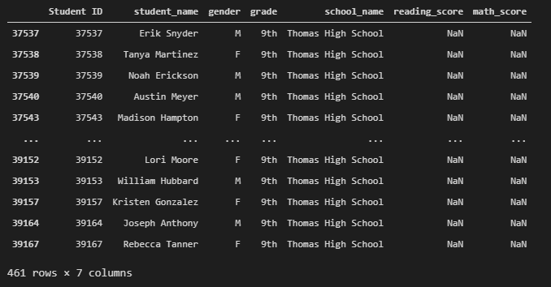
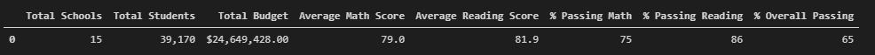
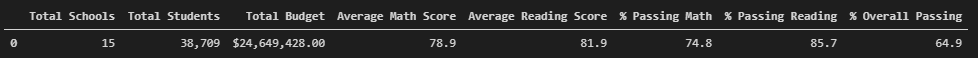
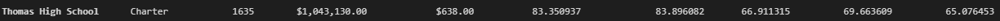
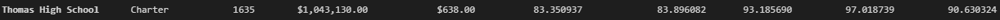
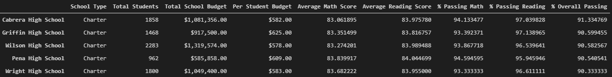
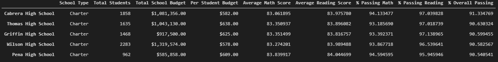

# School_District_Analysis

## Project Overview

- Create a high-level analysis of the key metrics, and display it in a table format

- Create an overall table of key metrics for each school
  
Create a table for each of the following focused metrics:
- Using the passing rate, show the Top 5 and Bottom 5 schools in the district
  
- The average math score received by students in each grade level at each school
  
- The average reading score received by students in each grade level at each school
  
- School performance based on the budget per student, grouped by the following per student amounts:
    - <$584	
    - $585-629
    - $630-644
    - $645-675
  
- School performance based on school size, grouped by the following school sizes:
    - Small (<1000)
    - Medium (1000-2000)
    - Large (2000-5000)
 
- School performance based on the type of school (District or Charter)
  
- District official suspected scores for 9th graders at Thomas High School had been altered. Therefore, the following code was added to remove the scores for those students:
  
''' python

    # Step 2. Use the loc method on the student_data_df to select all the reading scores from the 9th grade at Thomas High School and replace them with NaN.

    student_data_df.loc[(student_data_df["grade"] == "9th") & (student_data_df["school_name"] == "Thomas High School"), "reading_score"] = np.nan

    #  Step 3. Refactor the code in Step 2 to replace the math scores with NaN.

    student_data_df.loc[(student_data_df["grade"] == "9th") & (student_data_df["school_name"] == "Thomas High School"), "math_score"] = np.nan

    #  Step 4. Check the student data for NaN's. 

    student_data_df.loc[(student_data_df["grade"] == "9th") & (student_data_df["school_name"] == "Thomas High School")]
'''
  
  
## Resources
- schools_complete.csv

- students_complete.csv
  
## Results
The following are screenshots from before and after the removal of the suspect test scores:
- **District Summary** - the district scores and percentages were marginally affected
  
    - Before  
  
    - After
  

- **School Summary** - only scores for Thomas High School were affected, as follows

  - Before  

  - After

- **Top 5 Schools** - removing the scores moved Thomas High School into the Top 5

  - Before  

  - After

Replacing the scores for Thomas High School 9th graders has affected the following metrics:

- Overall District 9th grade scores increased
- Score averages increased in relation to school spending
- Medium-sized school scores increased
- Charter schools average scores increased

## Summary

Removing the scores for 9th graders from Thomas High School had the following major impacts:
1. Thomas High School became one of the top five(5) performing schools in the district.
2. The average reading and math scores for charter schools was greatly increased.
3. Medium-sized schools (1000-2000 students) saw an increase in scores.
4. Judging by the new score averages, the scores for the 9th graders at Thomas High were definitely suspect.